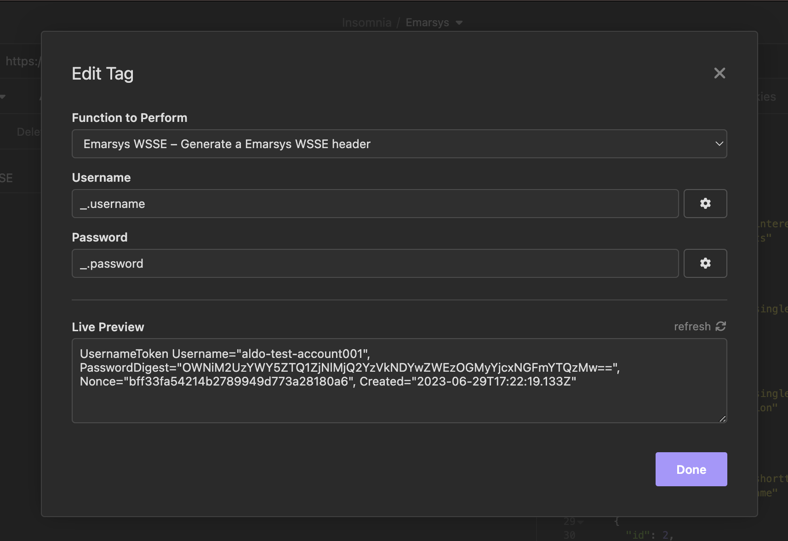
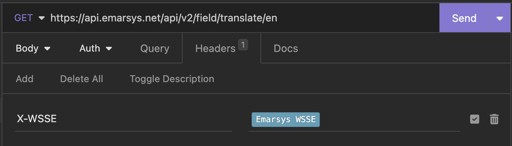

# insomnia-emarsys-wsse
Insomnia plugin to calculate Emarsys WSSE header

No depenedencies

Work with Emarsys [API](https://dev.emarsys.com/)

Add your credentials

Add the X-WSSE header with the plugin as value
